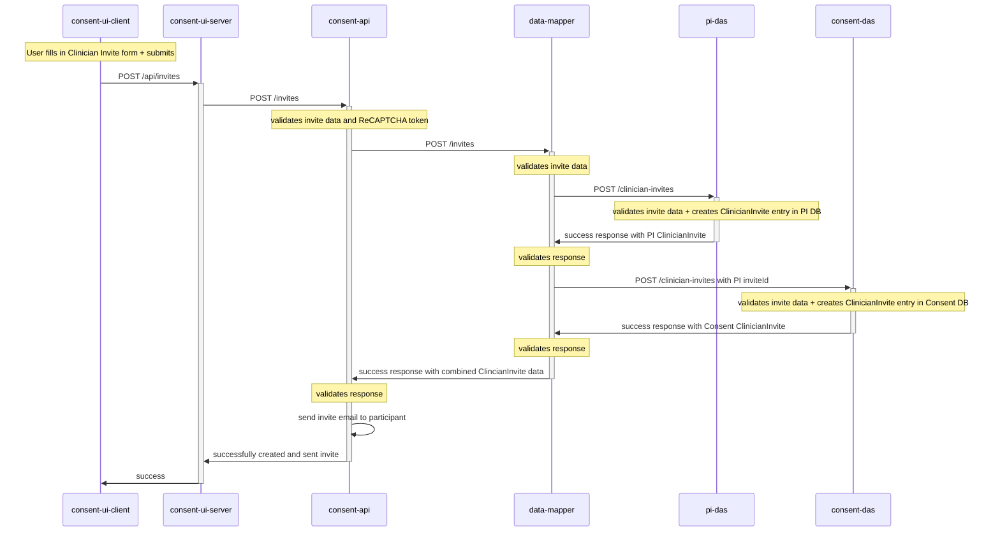

```mermaid
sequenceDiagram
    participant client as consent-ui-client
    participant server as consent-ui-server
    participant consent-api
    participant data-mapper
    participant pi-das
    participant consent-das
    participant consent-api

    Note over client: User fills in Clinician Invite form + submits
	client->>+server: POST /api/invites
    server->>+consent-api: POST /invites
    Note over consent-api: validates invite data and ReCAPTCHA token
    consent-api->>+data-mapper: POST /invites
    Note over data-mapper: validates invite data
    data-mapper->>+pi-das: POST /clinician-invites
    Note over pi-das: validates invite data + creates ClinicianInvite entry in PI DB
    pi-das->>-data-mapper: success response with PI ClinicianInvite
    Note over data-mapper: validates response
    data-mapper->>+consent-das: POST /clinician-invites with PI inviteId
    Note over consent-das: validates invite data + creates ClinicianInvite entry in Consent DB
    consent-das->>-data-mapper: success response with Consent ClinicianInvite
    Note over data-mapper: validates response
    data-mapper->>-consent-api: success response with combined ClincianInvite data
    Note over consent-api: validates response
    consent-api->>consent-api: send invite email to participant
    consent-api->>-server: successfully created and sent invite
    server->>-client: success
```
