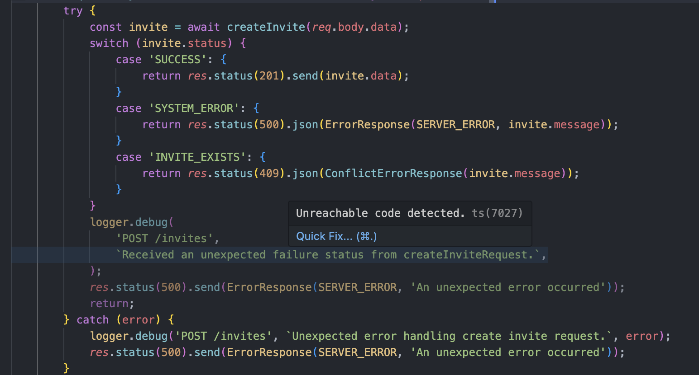
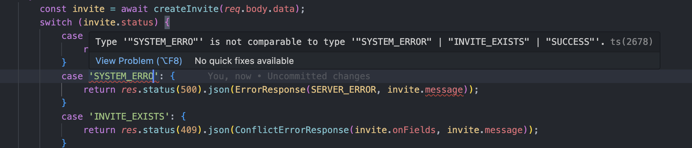

# Error Handling

This document describes how we use shared types to standardize error handling in our API services.

## Implementation

### Location

All types related to error handling are defined in the [`types/httpResponses`](../packages/types/src/httpResponses) folder, including:

- [`Result.ts`](../packages/types/src/httpResponses/Result.ts) — contains types that encapsulate success and failure results returned from our API service functions. More about this below.
- [`ErrorResponse.ts`](../packages/types/src/httpResponses/ErrorResponse.ts) — contains the `ErrorResponse` type and constructor that encapsulates the base requirements for any HTTP error response we return from an API endpoint: an `error` name and `message` describing it.
  - More specific error types can extend this type, for instance, the [`RequestValidationErrorResponse`](../packages/types/src/httpResponses/RequestValidationErrorResponse.ts) extends `ErrorResponse` to include and specify details provided by the Zod validation error which accompanies that response.

### Result Types

Every API service function can result in either a success or a failure. To standardize the response that routers can expect to receive across all our services, we have a `Success` and `Failure` type:

```ts
export type Success<T> = { status: 'SUCCESS'; data: T };
export type Failure<FailureStatus extends string, T = void> = {
	status: FailureStatus;
	message: string;
	data: T;
};
```

Both types have a `status` field which indicates the status of the result, and a `data` field which is the resulting data to be returned. `Success` and `Failure` are identical with the exception of a few details:

- `Failure` has an additional `message` field which provides details about the reason of failure
- `Success` has a status of `"SUCCESS"`

Note that the `Failure` type is allowed to return `data` — this can be a fallback response of type `T` to return in the case of failure, however it defaults to `void` as in most cases we just want to return an error message.

> **A word about generic types**: by using a generic type for the `data` field we enforce the type of data that can be returned. Similarly, by enforcing the `status` type of `Failure`, we can enforce the different statuses that can be returned in the case of a service failure, and handle those appropriately. By enforcing it to `extend string`, the status must be a string value. See more about this in the [Using `Result` as a Return Type](#using-result-as-a-return-type) section.

The `Result<T, FailureStatus>` type encapsulates the possible return types of a service function as either a `Success` or `Failure`. In particular, it represents a response that on success will include data of type `T`, otherwise a message will be returned in place of the data explaining the failure and optional data to be returned as a fallback.

```ts
export type Result<T, FailureStatus extends string, FailureData = void> =
	| Success<T>
	| Failure<FailureStatus, FailureData>;
```

### Error Types

We have an enum in the [`ErrorResponse.ts`](../packages/types/src/httpResponses/ErrorResponse.ts) file to specify the types of error responses we can return in our endpoints:

```ts
export enum ErrorName {
	SERVER_ERROR = 'ServerError',
	CONFLICT_ERROR = 'ConflictError',
	REQUEST_VALIDATION_ERROR = 'RequestValidationError',
	RECAPTCHA_ERROR = 'RecaptchaError',
}
```

These are the permitted values for the `error` field of an `ErrorResponse`, indicating the type of error thrown. For convenience, below is a description of when to use each error:

| Error Name                 | Status | Description                                                                                                                                                                        |
| -------------------------- | ------ | ---------------------------------------------------------------------------------------------------------------------------------------------------------------------------------- |
| `SERVER_ERROR`             | 500    | An issue occurred on our server side. When another system is returning invalid responses, our service should return a 500 status with a generic "Unexpected server error" message. |
| `CONFLICT_ERROR`           | 409    | A request is prevented from being made because it conflicts with existing data.                                                                                                    |
| `REQUEST_VALIDATION_ERROR` | 400    | A request was made with an invalid request body.                                                                                                                                   |
| `RECAPTCHA_ERROR`          | 400    | A ReCAPTCHA token could not be verified.                                                                                                                                           |

Most errors that we might receive are not relevant information that the client can respond to; for these types of errors we default to sending a `500 ServerError` and logging the actual error. These errors don’t need to be handled uniquely, simply returning a `Failure` with a status of `"SYSTEM_ERROR"` and the message `"An unexpected error occurred."` from services, which gets received by routers and sent as a `500 ServerError` response with that message is sufficient.

We only need to ensure specific error handling at each level above where an error occurred if that error requires passing information to the client through the appropriate HTTP response. For example, for the “Participant email already exists” error in the Clinician Invite flow, because it originates in the PI DAS and we would want the client to receive a `409 ConflictError`, we need to make sure Data Mapper and Consent API can distinguish it as a conflict error and send the appropriate response.

## Usage

### Using `Result` as a Return Type

You can set the return type of a service function `Result<T, FailureStatus>` by specifying the type of data `T` to be returned if successful, and the different `FailureStatus` types to be returned if the service fails. Having a specific return type for the `FailureStatus` is beneficial because it allows us to enforce the types of statuses that the router (or another service calling this service) can expect to receive, and handle accordingly. Below is an example of how this is used in the `createInvite` service in Consent API.

```ts
type CreateInviteFailureStatus = 'SYSTEM_ERROR' | 'INVITE_EXISTS';

export const createInvite = async (
	inviteRequest: ClinicianInviteRequest,
): Promise<Result<ClinicianInviteResponse, CreateInviteFailureStatus>> => {
	...
};
```

Now in the router that calls `createInvite`, it can expect to either receive a status of `'SUCCESS'` which indicates success, otherwise `'SYSTEM_ERROR'` or `'INVITE_EXISTS'` indicating failure:

```ts
const invite = await createInvite(req.body.data);
switch (invite.status) {
	case 'SUCCESS': {
		return res.status(201).send(invite.data); // we can expect invite.data to be of type ClinicianInviteResponse
	}
	case 'SYSTEM_ERROR': {
		return res.status(500).json(ErrorResponse(SERVER_ERROR, invite.message));
	}
	case 'INVITE_EXISTS': {
		return res.status(409).json(ConflictErrorResponse(invite.message));
	}
}
```

It's helpful to point out: TS can detect that every `status` case has been caught in the `switch` statement, and flag any code below it as unreachable.



And importantly, if we tried writing a case for a status that was not specified, we get a TS error:



### `success()`, `failure()`, and `alternate()`

Some convenient methods have been added to `Result.ts` to construct `Success` and `Failure` types.

- `success()` constructs a `Success` and accepts the resulting data to return as an argument
  ```ts
  if (invite.success) {
  	return success(invite.data); // returns { status: "SUCCESS", data: invite.data }
  }
  ```
- `failure()` constructs a basic `Failure` and accepts the failure status and message
  ```ts
  if (!invite.success) {
  	return failure('SYSTEM_ERROR', invite.error); // returns { status: "SYSTEM_ERROR", message: invite.error }
  }
  ```
- `alternate()` constructs a `Failure` that accepts the same parameters as `failure()` but with the addition of a `data` parameter, so it can provide a fallback data response
  ```ts
  if (!invite.success) {
  	return alternate('SYSTEM_ERROR', invite.default, invite.error); // returns { status: "SYSTEM_ERROR", data: invite.default, message: invite.error }
  }
  ```
  It's important to note that this method couldn't be combined with `failure()` because `data` takes a generic type, which makes it difficult for TS to infer the type correctly and ensure that `undefined` is compatible with the type `T` if we make `data` an optional parameter

## Other Notes

### Prisma Errors

When implementing services in the DAS that query the Prisma client, it's helpful to look at their documentation for [error references](https://www.prisma.io/docs/reference/api-reference/error-reference). This lists all possible errors that can return from making a request. In particular, the [error codes](https://www.prisma.io/docs/reference/api-reference/error-reference#error-codes) are most useful in distinguishing the type of error that occurred. Listed below are some common codes:

| Prisma Client Code | Message |
| --- | --- |
| [P2002](https://www.prisma.io/docs/reference/api-reference/error-reference#p2002) | "Unique constraint failed on the {constraint}” |
| [P2025](https://www.prisma.io/docs/reference/api-reference/error-reference#p2025) | "An operation failed because it depends on one or more records that were required but not found. {cause}” |
