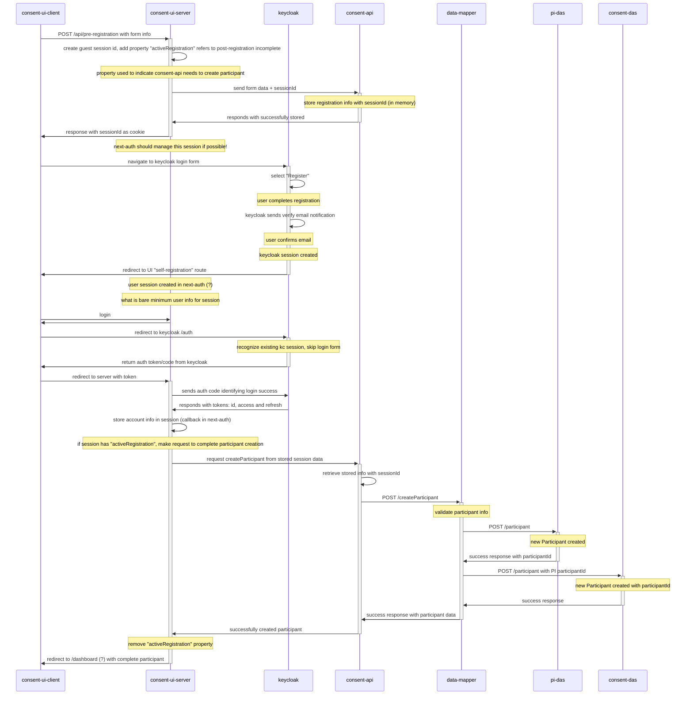

```mermaid
sequenceDiagram
    participant client as consent-ui-client
    participant server as consent-ui-server
    participant keycloak
    client->>+server: POST /api/pre-registration with form info
    server->>server: create guest session id, add property "activeRegistration" refers to post-registration incomplete
    Note over server: property used to indicate consent-api needs to create participant
    server->>+consent-api: send form data + sessionId
    Note over consent-api: store registration info with sessionId (in memory)
    consent-api->>-server: responds with successfully stored
    server->>-client: response with sessionId as cookie
    Note over server: next-auth should manage this session if possible!
    client->>+keycloak: navigate to keycloak login form
    keycloak->>keycloak: select "Register"
    Note over keycloak: user completes registration
    keycloak->>keycloak: keycloak sends verify email notification
    Note over keycloak: user confirms email
    Note over keycloak: keycloak session created
    keycloak->>-client: redirect to UI "self-registration" route
    Note over server: user session created in next-auth (?)
    Note over server: what is bare minimum user info for session
    %% Note over consent-ui: if kc register req isolated from next auth, prompt user to login after registration redirect
    client->>server: login
    server->>client: 
    client->>+keycloak: redirect to keycloak /auth
    Note over keycloak: recognize existing kc session, skip login form
    keycloak->>-client: return auth token/code from keycloak
    client->>+server: redirect to server with token
    server->>keycloak: sends auth code identifying login success
    keycloak->>server: responds with tokens: id, access and refresh
    server->>server: store account info in session (callback in next-auth)
    Note over server: if session has "activeRegistration", make request to complete participant creation
    server->>+consent-api: request createParticipant from stored session data
    consent-api->>consent-api: retrieve stored info with sessionId
    consent-api->>+data-mapper: POST /createParticipant
    Note over data-mapper: validate participant info
    data-mapper->>+pi-das: POST /participant
    Note over pi-das: new Participant created
    pi-das->>-data-mapper: success response with participantId
    data-mapper->>+consent-das: POST /participant with PI participantId
    Note over consent-das: new Participant created with participantId
    consent-das->>-data-mapper: success response
    data-mapper->>-consent-api: success response with participant data
    consent-api->>-server: successfully created participant
    Note over server: remove "activeRegistration" property
    server->>-client: redirect to /dashboard (?) with complete participant
```