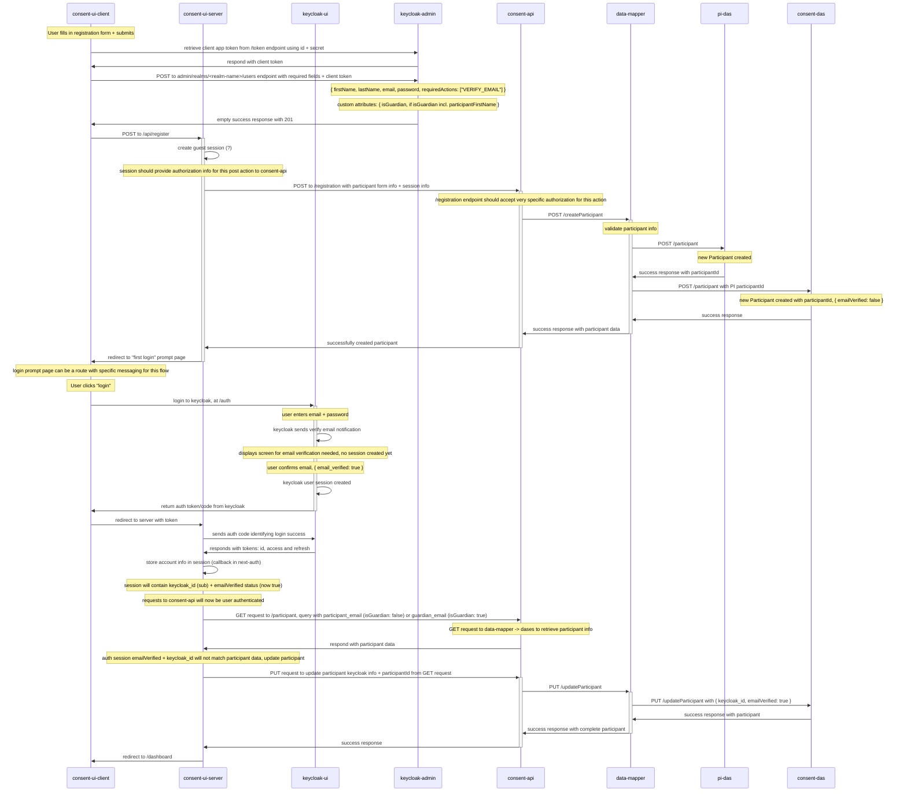

```mermaid
sequenceDiagram
    participant client as consent-ui-client
    participant server as consent-ui-server
    participant keycloak-ui
    participant keycloak as keycloak-admin
    participant consent-api
    participant data-mapper
    participant pi-das
    participant consent-das

    Note over client: User fills in registration form + submits
    client->>keycloak: retrieve client app token from /token endpoint using id + secret
    keycloak->>client: respond with client token
    client->>keycloak: POST to admin/realms/<realm-name>/users endpoint with required fields + client token
    Note over keycloak: { firstName, lastName, email, password, requiredActions: ["VERIFY_EMAIL"] }
    Note over keycloak: custom attributes: { isGuardian, if isGuardian incl. participantFirstName }
    keycloak->>client: empty success response with 201
    client->>+server: POST to /api/register
    server->>server: create guest session (?)
    Note over server: session should provide authorization info for this post action to consent-api
    server->>+consent-api: POST to /registration with participant form info + session info
    Note over consent-api: /registration endpoint should accept very specific authorization for this action
    consent-api->>+data-mapper: POST /createParticipant
    Note over data-mapper: validate participant info
    data-mapper->>pi-das: POST /participant
    Note over pi-das: new Participant created
    pi-das->>data-mapper: success response with participantId
    data-mapper->>consent-das: POST /participant with PI participantId
    Note over consent-das: new Participant created with participantId, { emailVerified: false }
    consent-das->>data-mapper: success response
    data-mapper->>-consent-api: success response with participant data
    consent-api->>-server: successfully created participant
    server->>-client: redirect to "first login" prompt page
    Note over client: login prompt page can be a route with specific messaging for this flow
    Note over client: User clicks "login"
    client->>+keycloak-ui: login to keycloak, at /auth
    Note over keycloak-ui: user enters email + password
    keycloak-ui->>keycloak-ui: keycloak sends verify email notification
    Note over keycloak-ui: displays screen for email verification needed, no session created yet
    Note over keycloak-ui: user confirms email, { email_verified: true }
    keycloak-ui->>keycloak-ui: keycloak user session created
    keycloak-ui->>-client: return auth token/code from keycloak
    client->>server: redirect to server with token
    server->>keycloak-ui: sends auth code identifying login success
    keycloak-ui->>server: responds with tokens: id, access and refresh
    server->>server: store account info in session (callback in next-auth)
    Note over server: session will contain keycloak_id (sub) + emailVerified status (now true)
    Note over server: requests to consent-api will now be user authenticated
    server->>consent-api: GET request to /participant, query with participant_email (isGuardian: false) or guardian_email (isGuardian: true)
    Note over consent-api: GET request to data-mapper -> dases to retrieve participant info
    consent-api->>server: respond with participant data
    Note over server: auth session emailVerified + keycloak_id will not match participant data, update participant
    server->>+consent-api: PUT request to update participant keycloak info + participantId from GET request
    consent-api->>+data-mapper: PUT /updateParticipant
    data-mapper->>consent-das: PUT /updateParticipant with { keycloak_id, emailVerified: true }
    consent-das->>data-mapper: success response with participant
    data-mapper->>-consent-api: success response with complete participant
    consent-api->>-server: success response
    server->>client: redirect to /dashboard
```