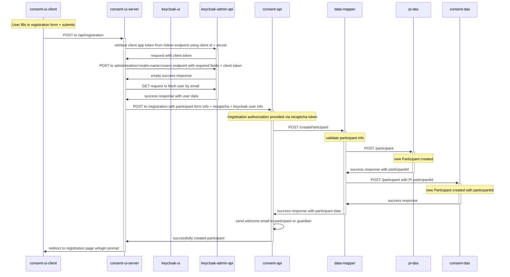
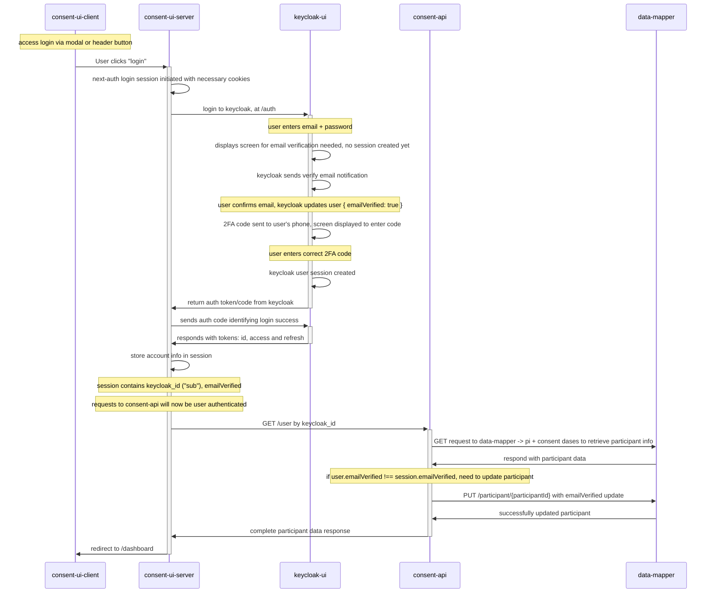

# Participant Registration Flow

### Registration Flow Part A
#### Creating the User in Keycloak + OHCRN Backend

When the user is redirected back to the login prompt screen, they can choose either to continue to login and complete the entire flow (Part B), or pause and finish later.

### Registration Flow Part B
#### User Login and Email Verification

