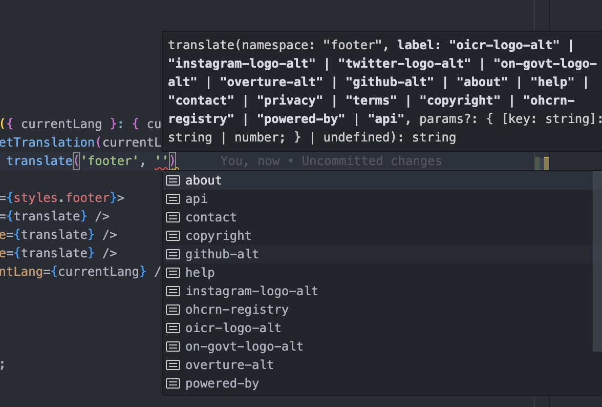

# Translations

This document describes how text content is translated in the Consent UI.

## Implementation

### Location

All translation-related code is located in the [`/apps/consent-ui/src/i18n/` folder](../apps/consent-ui/src/i18n/), including:

- [`/locales/`](../apps/consent-ui/src/i18n/locales/) => contains the dictionaries for each supported language. We are currently supporting English (`en` folder) and French (`fr` folder)
- [`/utils/`](../apps/consent-ui/src/i18n/utils/) => utility functions for retrieving translated values from the dictionaries
- [`/types/`](../apps/consent-ui/src/i18n/types/) => types for utils and supported languages
- [`/routes/`](../apps/consent-ui/src/i18n/routes/) => a `.json` dictionary that defines the route key names and translated values for translated paths. The setup for translated routes is separate and is not covered in this README.

### Terms

- `"locale"` refers to a supported language.
- `"namespace"` refers to the named file convention within a locale folder, and corresponds generally with the component it is used in. There are some special cases, for example enum values from the `Types` package, that have their own namespace for the sake of code organization.
- `"dictionary"` refers to the set of definitions within a namespace file.

### Type Structure

The English dictionaries will be the source of truth for the expected type structure of all dictionaries. This means that any new namespace or namespace key added in [`/locales/en/`](../apps/consent-ui/src/i18n/locales/en/) should trigger TS errors in [`/locales/fr/`](../apps/consent-ui/src/i18n/locales/fr/). The opposite is also true: attempting to add a namespace or key in the French dictionaries that is not already in the English dictionaries will cause TS to error. This is achieved with TS `satisfies` operator to preserve type structure:

```typescript
// # in a locale dictionary set:
import en from 'src/i18n/locales/en/index'; // import english dictionary
import commonDictionary from 'src/i18n/locales/fr/common';

const frenchDictionaries = {
	common: commonDictionary, // imported dictionary matches same dictionary in `en` locale
	 ...
} satisfies typeof en;
```

```typescript
// # in a namespace:
import { CommonDictionary } from 'src/i18n/locales/en/common';

const frenchCommonDictionary = { ... } satisfies CommonDictionary;
```

## Usage

### The `getTranslation()` function

`getTranslation` is not required to be async but should still be used server side only, as the entire dictionary for a locale is loaded on function call. Keeping this function on the server should also protect against any discrepancy in the current language between server and client.

> **Important:**
> Do not call this function inside any client component (a file headed by `'use client'`), as this will import the entire dictionary onto the client!

#### Basic usage:

Define a `translate()` function:

```typescript
const { translate } = getTranslation('en');
```

which can then be used to access a translated string with a `namespace` + `key`

```typescript
const translatedString = translate('footer', 'about');
// => 'About OHCRN'
```

> **Note:**
> Namespace and key are both required args for getTranslation. Thanks to the typing of the dictionaries and `getTranslation`, VS Code IntelliSense should provide autocomplete options for the namespace and dictionary key arguments.




#### Using with parameters for string interpolation:

```typescript
const { translate } = getTranslation('fr');
const translatedString = translate('footer', 'copyright', { year: '2023' });
// => '© 2023 Ontario Hereditary Cancer Research Network. Tous droits réservés.'
```

#### Translating a Namespace

Translate an entire namespace at once when you want to pass down many translations from a server component to a client component, e.g. for forms.

We're keeping all translations on the server side and can't access these functions on the client side. This is a convenience function to collect all translations in the parent (server component) and pass them to the child (client component).

First, create a separate namespace for the client component, e.g. `/en/myForm.ts`. Then call `translateNamespace('myForm')`. Pass down the translated namespace to the form as a prop, with the namespace's type. From there you can access translations by their key (`formDict.translationKey`).

Parent server component:

```typescript
const { translateNamespace } = getTranslation(currentLang);
const formDict = translateNamespace('myForm');

return <MyForm formDict={formDict} />;
```

Client component that contains a form:

```typescript
'use client';

const MyForm = ({ formDict }: { formDict: MyFormDictionary }) => (
	<Form onSubmit={handleSubmit}>{formDict.description}</Form>
);
```

### How to Add a Dictionary Namespace

Create a new file for your namespace in the `en` locale folder
"my-namespace.ts"

For the sake of simplicity the object can be named `dictionary`, and append with a basic `{ ... } satisfies Record<string, string>` type. Be sure the exported named type matches the `<Namespace>Dictionary` convention, where `Namespace` matches your filename:

```typescript
// "/locales/en/my-namespace.ts"
const dictionary = {} satisfies Record<string, string>;

export type MyNamespaceDictionary = Record<keyof typeof dictionary, string>;

export default dictionary;
```

Then add this dictionary to the top-level `dictionaries` definition in [`/locales/en/index.ts`](../apps/consent-ui/src/i18n/locales/en/index.ts):

```typescript
// "/locales/en/index.ts"
import myNamespaceDictionary from './my-namespace.js'

const dictionaries = {
	...,
	'my-namespace': myNamespaceDictionary
}

export default dictionaries;
```

At this point TS should now be showing errors in the [`/locales/fr/index.ts file`](../apps/consent-ui/src/i18n/locales/fr/index.ts), because this dictionary is no longer valid against the English dictionary structure. Fix this by adding a corresponding namespace file in the `fr` locale folder, and adding `{ namespace: namespaceDictionary }` to the French dictionaries definition. Be sure to add the `satisfies MyNamespaceDictionary` to the French namespace file definition.

### How to Add a Translation to a Namespace

New translations can be added as a simple `{ key: value }` pairs in the appropriate dictionary.

If the translation is referencing an enum value from the shared `Types` package, the key name can be defined using the enum, like so:

```typescript
import { Province } from 'types/entities';

const dictionary = {
	...,
	[Province.enum.ONTARIO]: 'Ontario'
}
```

#### With interpolated parameters:

Translation strings that require interpolated values should be defined with a `{{ }}` format string syntax:

```typescript

const dictionary = {
	...,
	'key-with-parameter': 'This string takes a "name" parameter: Hello, {{ name }}!',
	'key-with-repeated-parameter': 'For some reason we show the name {{ name }} to user {{ name }} twice.',
	'key-with-multiple-parameters': 'OHCRN supports {{ en }} language and {{ fr }} language.'
}
```

> **Note:**
> For readability the `{{ key }}` should have spaces around the key name, however the `replaceParams` util function will be able to parse `{{key}}`.

## How to translate dates

Dates require translation and different formatting in each language. Use `translateDate()` from the i18n utils folder:

```ts
translateDate(new Date('12/04/2024'), 'fr', 'numerical');
// returns '04/12/2024'
```

`CalendarInput` uses react-datepicker and doesn't require additional formatting.

## Outstanding TODOs

- handling missing translations - need to discuss whether this should trigger a visible UI error
- will need to implement a way to enforce translations in server components only
- empty namespace dictionaries have been created for routes/components that still need to be implemented.
- we are using available enums from Types package as dictionary keys; as other enums are added the remaining enum keys should be updated.
